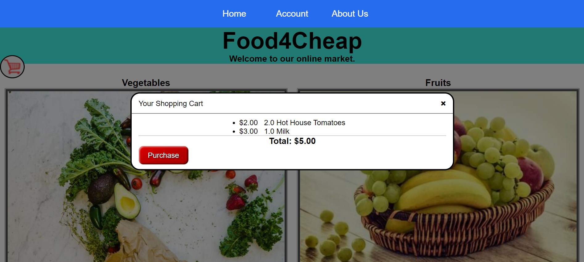

Food4Cheap Online Market
=============
Website link: https://food4cheap.herokuapp.com/

Food4Cheap is a fully online and modern grocery store concept.

Technologies used: Django/HTML/CSS/JavaScript/SQLite/PostgreSQL/Heroku

In our project, we:
* Created responsive webpage templates using HTML, CSS, and JavaScript.
* Created a CRUD login system where users can save their grocery cart history for later.
* Debugged both frontend and backend features through local testing environments.
* Did local implementation of backend with Django and SQLite.
* Deployed the applicaiton while migrating local database to the Heroku PostgreSQL server.
 
 Created by Ryan Kim and Malcolm Zhao.

